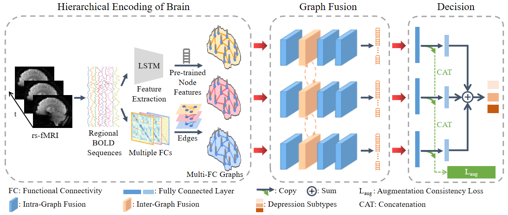

# Hierarchical Encoding and Fusion of Brain Functions for Depression Subtype Classification

This is the PyTorch implementation for the hierarchical encoding and fusion framework to diagnose depression subtypes based on rs-fMRI image. 

## Abstract
We propose a hierarchical encoding and fusion framework of brain functions. First, we
pre-train a model to extract the features from individual brain regions, which signify nodes in the brain functional network. Then, distinct
graphs are constructed to link the nodes within each subject, resulting in multi-view graphs of the brain functional network. We further
develop a graph fusion strategy to integrate the multi-view information, by referring to the local encoding of the nodes and their
interactions across multiple graph instances. Finally, we attain the classification of depression subtypes based on the fused graph
representation. 


## Framework



## Implementation 
The publicly available ABIDE dataset can be used to test our method. We focus on the
largest site (NYU) in ABIDE to avoid multi-site confounding.


## Usage: Preparation

### Installation

#### Clone
```bash
git clone https://github.com/mjliu2020/HEF.git 
cd HEF
```
#### Environment
```bash
conda env create -f HEFenv.yaml
conda activate HEFenv
```
- If you have any trouble installing PyTorch Geometric, please install PyG's dependencies manually.
- PYG's [FAQ](https://pytorch-geometric.readthedocs.io/en/latest/notes/installation.html#frequently-asked-questions) might be helpful.

### Data Preparation

#### Download
- We divide the preprocessed rs-fMRI of NYU into 90 brain regions based
on the automatic anatomical labeling (AAL) atlas. Then,
for each region, we average and derive the mean-time BOLD
sequence. 
- The above signal data of NYU can be downloaded at [Google Drive](https://drive.google.com/drive/folders/1i1hL5u78ZWi08zwBJ5DXI187rCgyObC9?usp=sharing). 
- Download and put them in `./Data_Preparation/`.

#### Multi-FC Calculation
- The Pearson correlation, Spearman correlation and partial correlation of brain region time series are calculated.

```python
cd Data_Preparation
python ./Clc_FC_Pearson.py
python ./Clc_FC_Spearman.py
python ./Clc_FC_partial.py
```

#### Calculation of Handcrafted Brain Region Features
- The time-series statistical features
(mean, standard deviation, skewness, and kurtosis) from
regional BOLD sequences are calculated.

```python
cd Data_Preparation
python ./Clc_HandcraftedFea.py
```

## Usage: Pre-training

### Training

```python
cd Pretrain
python ./pretrain_train.py
```
### Evaluation

```python
cd Pretrain
python ./pretrain_evaluation.py
```

### Feature Extraction of Brain Regions

```python
cd Pretrain
python ./pretrain_Clcnodefeature.py
```

## Usage: Classification

### Training

```python
cd Ours
python ./train.py
```

## License 
The code is released under GPL License (see LICENSE file for details).